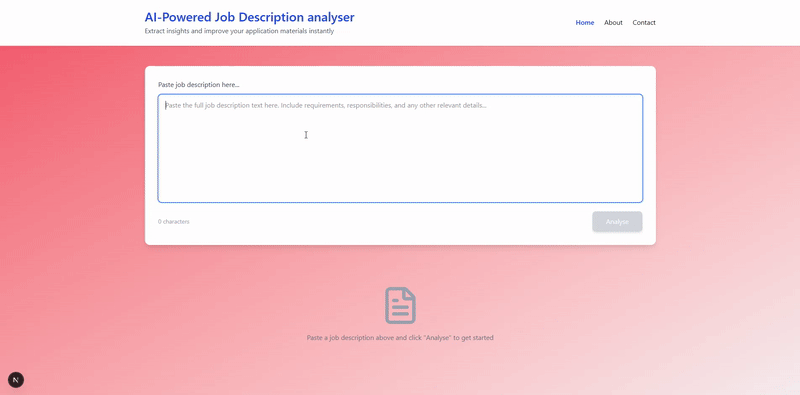

# AI Job Analyser Monorepo

A pnpm workspace with two Next.js applications:

- `apps/consumer-app`: Public-facing job description analyser
- `apps/admin-dashboard`: Internal admin dashboard (work in progress)

## Features

- Next.js 16 + React 19
- TypeScript, ESLint, Prettier
- Vitest for unit testing
- pnpm workspaces with shared CI

## Demo



## Getting Started

### Prerequisites

- Node.js 20+
- pnpm 10+

### Install

```powershell
cd apps
pnpm install
```

### Run (consumer-app)

```powershell
cd apps/consumer-app
pnpm run dev
```

- `consumer-app`: http://localhost:3000

Admin dashboard is not yet ready to run.

### Build (consumer-app)

```powershell
cd apps/consumer-app
pnpm run build
```

### Quality Checks

```powershell
cd apps
pnpm run format      # Prettier check (non-failing)
pnpm run typecheck   # TypeScript
pnpm run lint        # ESLint
pnpm run test        # Vitest (both apps)
```

To auto-fix lint issues:

```powershell
cd apps
pnpm run lint:fix
```

## Configuration

- Prettier: `.prettierrc.json` + `.prettierignore`
- Editor: `.vscode/settings.json` and `.editorconfig`
- ESLint: `apps/*/eslint.config.mjs`
- Workspace: `pnpm-workspace.yaml`

## CI

GitHub Actions workflow at `.github/workflows/ci.yml`:

- Restore pnpm store cache
- Install dependencies
- Build both apps
- Format check, typecheck, lint
- Run tests

## Environment Variables

`consumer-app` uses environment variables for AI services. Create `.env.local` in `apps/consumer-app`:

```
OPENAI_API_KEY=your_key
NODE_ENV=development
```

Do not commit any secrets.

## Project Structure

```
apps/
  consumer-app/
    app/               # Next.js routes & pages
    components/        # UI components
    lib/               # actions, services, utils
  admin-dashboard/
    app/               # Next.js routes
```

## Contributing

- Create a feature branch
- Run `pnpm run build` and `pnpm run test` before PR
- Ensure lint/typecheck pass

## Licence

Proprietary — internal use only.
